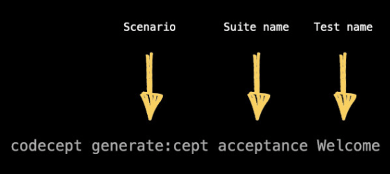

# Acceptance Testing With Codeception #

> Codeception: codeception.com

## Acceptance Testing ##

> Acceptance tests execute code from the outside in

> and will run in an environment that is as close to production as possible

> they will hit the database, query real web services

> they provide incredibly accurate and real-world results, but, as a side effect, have no choice but to be orders of magnitude slower than your unit tests

> what acceptance testing refers to, lock on to the word, **accept**.

> When building new features, the customer (whoever that might be) will typically describe the functionality that they require. We refer to these as **user stories**.

    As a user
    To more easily consume Tuts+ Premium content
    I want to download each course as a zip file

> (acceptance:) “I’ve implemented the feature you requested. Do you accept that it works as expected?”

> Tools like `Cucumber` were specifically written to give managers and quality assurance folks the ability to write these high-level tests themselves.

## Installation ##

    "require":{
        "laravel/framework": "4.0.*"
    },
    "require-dev":{
        "codeception/codeception": "1.6.1.1"
    }

## Bootstrapping ##

> Codeception is a full-stack testing framework and needs to be initialized for each new project.

    codecept bootstrap

> this command will dynamically generate a number of files within a tests/ directory.

> for Laravel applications, we want these files to be placed within **app/tests**.

> be sure to include the path argument

    codecept bootstrap app

## Configuring Acceptance Tests ##

## Generate a Test ##

### 1.Manual Approach ###

    // app/tests/acceptance/WelcomeCept.php
    <?php
        $I = new WebGuy($scenario);
        $I->wantTo('Check the home page for a welcome message');
        $I->amOnPage('/');
        $I->see('Welcome');

### 2.Generator Approach ###

    codecept generate:cept acceptance Welcome

> use the -c option to set the path to the configuration file as well.

> locate the codeception.yml file

    codecept generate:cept acceptance Welcome -c app

## Running All Tests ##

    codecept run

